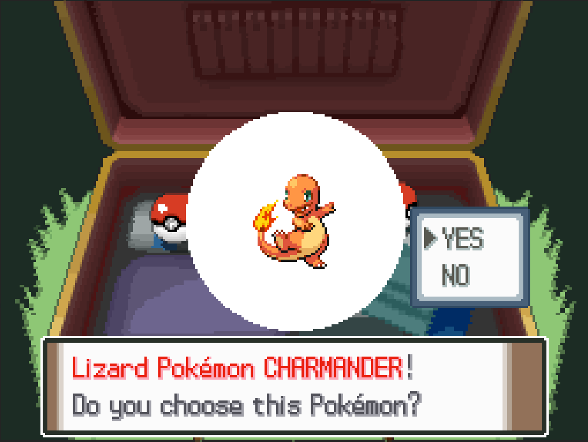

# Changing Starter Pokemon
*Author: RavePossum*

If you're making a ROMhack, you likely want to select some new starter Pokemon options. Here's how you'd go about doing that.

## Changing the starters in Rowan's bag

This involves a simple tweak in `src/choose_starter/choose_starter_app.c`:
```diff
#include "vram_transfer.h"

#define NUM_STARTER_OPTIONS 3
- #define STARTER_OPTION_0    SPECIES_TURTWIG
- #define STARTER_OPTION_1    SPECIES_CHIMCHAR
- #define STARTER_OPTION_2    SPECIES_PIPLUP
+ #define STARTER_OPTION_0    SPECIES_BULBASAUR
+ #define STARTER_OPTION_1    SPECIES_CHARMANDER
+ #define STARTER_OPTION_2    SPECIES_SQUIRTLE

#define OAM_MAIN_START 0
#define OAM_MAIN_END   128
```

## Changing the starters' descriptions
You'll also want to update the descriptions that display when selecting a starter. 

This is currently located in `res/text/unk_0360.json`:
```diff

    {
      "id": "pl_msg_00000360_00001",
      "en_US": [
-       "{COLOR 3}Tiny Leaf Pokémon TURTWIG{COLOR 0}!\n",
+       "{COLOR 3}Seed Pokémon BULBASAUR{COLOR 0}!\n",
        "Will you take this Pokémon?"
      ]
    },
    {
      "id": "pl_msg_00000360_00002",
      "en_US": [
-       "{COLOR 1}Chimp Pokémon CHIMCHAR{COLOR 0}!\n",
+       "{COLOR 1}Lizard Pokémon CHARMANDER{COLOR 0}!\n",
        "Do you choose this Pokémon?"
      ]
    },
    {
      "id": "pl_msg_00000360_00003",
      "en_US": [
-       "{COLOR 2}Penguin Pokémon{COLOR 0} {COLOR 2}PIPLUP{COLOR 0}!\n",
+       "{COLOR 2}Tiny Turtle Pokémon{COLOR 0} {COLOR 2}SQUIRTLE{COLOR 0}!\n",
        "Is this Pokémon the one for you?"
      ]
    },
```



## Changing the rival's Pokemon
The steps above will change the starter available to the player. However, the rival will now always have Turtwig since the game defaults to that if the player didn't choose Chimchar or Piplup. Changing the rival's Pokemon will involve modifying several other places:

- `src/system_vars.c`: The `SystemVars_GetRivalStarter()` function will need to be updated to reference your new starters. This controls the Pokemon name that gets buffered when the rival says their Pokemon's name. The same applies to the player's counterpart in `SystemVars_GetPlayerCounterpartStarter()` right below it.
- In `res/trainers/data/`, there are several files for the rival and counterpart teams, such as `rival_route_201_piplup.json`. You'll need to update these trainer parties to use your new starter pokemon. A good way to track all these down may be to project-wide search for `TRAINER_CLASS_RIVAL` with your text editor's search function or something like `git grep`.