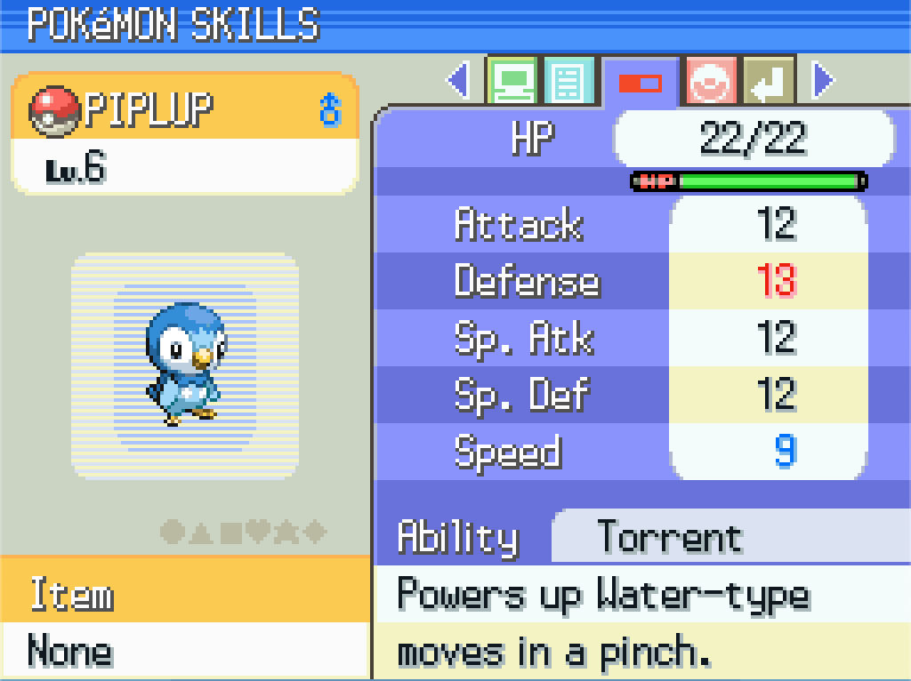

# Nature Stat Colors in Summary Screen
*Author: RavePossum*

The colored numbers that indicate boosts and drops to stats based on nature weren't added until HeartGold/SoulSilver. Let's add it to Platinum.

# New Function To Print Stats with Colors
First, we'll add a new function that will allow us to specify the color of the stat based on the Pokemon's nature. Let's add it in `src/pokemon_summary_screen/window.c`.

```diff
static void DrawRibbonsPageWindows(PokemonSummaryScreen *summaryScreen);
static void DrawExitPageWindows(PokemonSummaryScreen *summaryScreen);
+ static void PrintStatWithNatureColor(PokemonSummaryScreen *summaryScreen, int statType, enum SummaryExtraWindowSkills window);

```
```diff
    Window_ScheduleCopyToVRAM(&summaryScreen->extraWindows[SUMMARY_WINDOW_MEMO]);
}

+ static void PrintStatWithNatureColor(PokemonSummaryScreen *summaryScreen, int statType, enum SummaryExtraWindowSkills window)
+ {
+     int color;
+     switch (Pokemon_GetStatAffinityOf(summaryScreen->monData.nature, statType)) {
+     case -1:
+         color = SUMMARY_TEXT_BLUE;
+         break;
+     case 1:
+         color = SUMMARY_TEXT_RED;
+         break;
+     default:
+         color = SUMMARY_TEXT_BLACK;
+         break;
+     }
+ 
+     PrintStringToWindow(summaryScreen, &summaryScreen->extraWindows[window], color, ALIGN_RIGHT);
+ }

static void DrawSkillsPageWindows(PokemonSummaryScreen *summaryScreen)
{
```

# Call the Function When Printing Stats
Next we'll just need to call our new function whenever a stat is printed on the screen in `DrawSkillsPageWindows`, like so:

```diff
static void DrawSkillsPageWindows(PokemonSummaryScreen *summaryScreen)
{
    Window_ScheduleCopyToVRAM(&summaryScreen->staticWindows[SUMMARY_WINDOW_LABEL_SKILLS]);
    Window_ScheduleCopyToVRAM(&summaryScreen->staticWindows[SUMMARY_WINDOW_LABEL_HP]);
    Window_ScheduleCopyToVRAM(&summaryScreen->staticWindows[SUMMARY_WINDOW_LABEL_ATTACK]);
    Window_ScheduleCopyToVRAM(&summaryScreen->staticWindows[SUMMARY_WINDOW_LABEL_DEFENSE]);
    Window_ScheduleCopyToVRAM(&summaryScreen->staticWindows[SUMMARY_WINDOW_LABEL_SP_ATTACK]);
    Window_ScheduleCopyToVRAM(&summaryScreen->staticWindows[SUMMARY_WINDOW_LABEL_SP_DEFENSE]);
    Window_ScheduleCopyToVRAM(&summaryScreen->staticWindows[SUMMARY_WINDOW_LABEL_SPEED]);
    Window_ScheduleCopyToVRAM(&summaryScreen->staticWindows[SUMMARY_WINDOW_LABEL_ABILITY]);

    Window_FillTilemap(&summaryScreen->extraWindows[SUMMARY_WINDOW_HP], 0);
    Window_FillTilemap(&summaryScreen->extraWindows[SUMMARY_WINDOW_ATTACK], 0);
    Window_FillTilemap(&summaryScreen->extraWindows[SUMMARY_WINDOW_DEFENSE], 0);
    Window_FillTilemap(&summaryScreen->extraWindows[SUMMARY_WINDOW_SP_ATTACK], 0);
    Window_FillTilemap(&summaryScreen->extraWindows[SUMMARY_WINDOW_SP_DEFENSE], 0);
    Window_FillTilemap(&summaryScreen->extraWindows[SUMMARY_WINDOW_SPEED], 0);
    Window_FillTilemap(&summaryScreen->extraWindows[SUMMARY_WINDOW_ABILITY], 0);
    Window_FillTilemap(&summaryScreen->extraWindows[SUMMARY_WINDOW_ABILITY_DESCRIPTION], 0);

    u32 hpWindowWidth = Window_GetWidth(&summaryScreen->extraWindows[SUMMARY_WINDOW_HP]) * 8;

    PrintCurrentAndMaxInfo(summaryScreen, 0, PokemonSummary_Text_Slash, PokemonSummary_Text_TemplateCurrentHp, PokemonSummary_Text_TemplateMaxHp, summaryScreen->monData.curHP, summaryScreen->monData.maxHP, 3, hpWindowWidth / 2, 0);
    SetAndFormatNumberBuf(summaryScreen, PokemonSummary_Text_TemplateAttack, summaryScreen->monData.attack, 3, PADDING_MODE_NONE);
-    PrintStringToWindow(summaryScreen, &summaryScreen->extraWindows[SUMMARY_WINDOW_ATTACK], SUMMARY_TEXT_BLACK, ALIGN_RIGHT);
+    PrintStatWithNatureColor(summaryScreen, STAT_ATTACK, SUMMARY_WINDOW_ATTACK);
    SetAndFormatNumberBuf(summaryScreen, PokemonSummary_Text_TemplateDefense, summaryScreen->monData.defense, 3, PADDING_MODE_NONE);
-    PrintStringToWindow(summaryScreen, &summaryScreen->extraWindows[SUMMARY_WINDOW_DEFENSE], SUMMARY_TEXT_BLACK, ALIGN_RIGHT);
+    PrintStatWithNatureColor(summaryScreen, STAT_DEFENSE, SUMMARY_WINDOW_DEFENSE);
    SetAndFormatNumberBuf(summaryScreen, PokemonSummary_Text_TemplateSpAttack, summaryScreen->monData.spAttack, 3, PADDING_MODE_NONE);
-    PrintStringToWindow(summaryScreen, &summaryScreen->extraWindows[SUMMARY_WINDOW_SP_ATTACK], SUMMARY_TEXT_BLACK, ALIGN_RIGHT);
+    PrintStatWithNatureColor(summaryScreen, STAT_SPECIAL_ATTACK, SUMMARY_WINDOW_SP_ATTACK);
    SetAndFormatNumberBuf(summaryScreen, PokemonSummary_Text_TemplateSpDefense, summaryScreen->monData.spDefense, 3, PADDING_MODE_NONE);
-    PrintStringToWindow(summaryScreen, &summaryScreen->extraWindows[SUMMARY_WINDOW_SP_DEFENSE], SUMMARY_TEXT_BLACK, ALIGN_RIGHT);
+    PrintStatWithNatureColor(summaryScreen, STAT_SPECIAL_DEFENSE, SUMMARY_WINDOW_SP_DEFENSE);
    SetAndFormatNumberBuf(summaryScreen, PokemonSummary_Text_TemplateSpeed, summaryScreen->monData.speed, 3, PADDING_MODE_NONE);
-    PrintStringToWindow(summaryScreen, &summaryScreen->extraWindows[SUMMARY_WINDOW_SPEED], SUMMARY_TEXT_BLACK, ALIGN_RIGHT);
+    PrintStatWithNatureColor(summaryScreen, STAT_SPEED, SUMMARY_WINDOW_SPEED);

    StringTemplate_SetAbilityName(summaryScreen->strFormatter, 0, summaryScreen->monData.ability);
    String *buf = MessageLoader_GetNewString(summaryScreen->msgLoader, PokemonSummary_Text_TemplateAbility);
    StringTemplate_Format(summaryScreen->strFormatter, summaryScreen->string, buf);
    String_Free(buf);

    PrintStringToWindow(summaryScreen, &summaryScreen->extraWindows[SUMMARY_WINDOW_ABILITY], SUMMARY_TEXT_BLACK, ALIGN_LEFT);
    MessageLoader *msgLoader = MessageLoader_Init(MSG_LOADER_LOAD_ON_DEMAND, NARC_INDEX_MSGDATA__PL_MSG, TEXT_BANK_ABILITY_DESCRIPTIONS, HEAP_ID_POKEMON_SUMMARY_SCREEN);
    MessageLoader_GetString(msgLoader, summaryScreen->monData.ability, summaryScreen->string);
    MessageLoader_Free(msgLoader);
    PrintStringToWindow(summaryScreen, &summaryScreen->extraWindows[SUMMARY_WINDOW_ABILITY_DESCRIPTION], SUMMARY_TEXT_BLACK, ALIGN_LEFT);

    Window_ScheduleCopyToVRAM(&summaryScreen->extraWindows[SUMMARY_WINDOW_HP]);
    Window_ScheduleCopyToVRAM(&summaryScreen->extraWindows[SUMMARY_WINDOW_ATTACK]);
    Window_ScheduleCopyToVRAM(&summaryScreen->extraWindows[SUMMARY_WINDOW_DEFENSE]);
    Window_ScheduleCopyToVRAM(&summaryScreen->extraWindows[SUMMARY_WINDOW_SP_ATTACK]);
    Window_ScheduleCopyToVRAM(&summaryScreen->extraWindows[SUMMARY_WINDOW_SP_DEFENSE]);
    Window_ScheduleCopyToVRAM(&summaryScreen->extraWindows[SUMMARY_WINDOW_SPEED]);
    Window_ScheduleCopyToVRAM(&summaryScreen->extraWindows[SUMMARY_WINDOW_ABILITY]);
    Window_ScheduleCopyToVRAM(&summaryScreen->extraWindows[SUMMARY_WINDOW_ABILITY_DESCRIPTION]);
}
```

Now the color of stats will reflect the Pokemon's nature.

