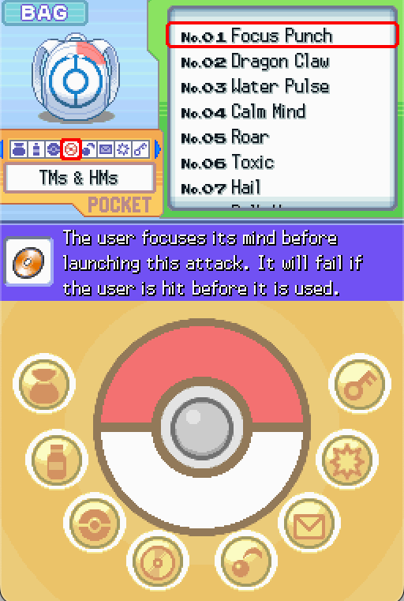

# Make TMs Reusable
*Author: RavePossum*

The new generations of Pokemon games make TMs reusable instead of single-use. Let's change Platinum so TMs are reusable here as well.

## Reuseable TMs
Make the following change:

`src/applications/party_menu/unk_02084B70.c`:
```diff
static void TeachMove(PartyMenuApplication *application, Pokemon *mon, u32 moveSlot)
{
    u32 tempVar = application->partyMenu->learnedMove;
    Pokemon_SetValue(mon, MON_DATA_MOVE1 + moveSlot, &tempVar);
    tempVar = 0;
    Pokemon_SetValue(mon, MON_DATA_MOVE1_PP_UPS + moveSlot, &tempVar);
    tempVar = MoveTable_CalcMaxPP(application->partyMenu->learnedMove, 0);
    Pokemon_SetValue(mon, MON_DATA_MOVE1_PP + moveSlot, &tempVar);

    if (application->partyMenu->usedItemID != 0) {
-       if (Item_IsHMMove(application->partyMenu->learnedMove) == FALSE) {
-           Bag_TryRemoveItem(application->partyMenu->bag, application->partyMenu->usedItemID, 1, HEAP_ID_PARTY_MENU);
-       }

        Pokemon_UpdateFriendship(mon, 4, (u16)GetCurrentMapLabel(application));
    }
}
```

This will make it so using a TM doesn't remove the item from your bag. 

## Remove TM quantities
To make the experience more polished, you may want to remove the quantity of the TM from the bag screen so it's more obvious they're reusable (like HMs). Make the following change:

`src/applications/bag/windows.c`:
```diff
void BagUI_PrintTMHMNumber(BagController *controller, BagItem *itemSlot, u32 yOffset)
{
    u16 item = itemSlot->item;
    if (item < ITEM_HM01) {
        item = item - ITEM_TM01 + 1;
        FontSpecialChars_DrawPartyScreenText(controller->specialChars, SPECIAL_CHAR_NUMBER, item, 2, PADDING_MODE_ZEROES, &controller->windows[BAG_UI_WINDOW_ITEM_LIST], 0, yOffset + 5);
-       BagUI_PrintItemCount(controller, itemSlot->quantity, yOffset, TEXT_COLOR(1, 2, 0));
    } else {
        item = item - ITEM_HM01 + 1;
        FontSpecialChars_DrawPartyScreenHPText(controller->specialChars, item, 2, PADDING_MODE_SPACES, &controller->windows[BAG_UI_WINDOW_ITEM_LIST], 16, yOffset + 5);
```



## Untossable TMs
You'll likely also want to make it so the player cannot toss TMs or give them to their Pokemon. This is a simple change in `pl_item_data.csv` - for each TM (starting with `ITEM_TM01` and all the way through `ITEM_TM92`), set the `prevent_toss` column to `true` instead of `false`. This may be quicker with a spreadsheet editing program (Excel, Google Sheets) or a regular expression substitution.

## Prevent buying duplicate TMs in shops
We'll also want to make sure the player can't waste their money on the same TM twice in shops. Head over to `src/overlay007/shop_menu.c` and add the following code:
```diff
static u8 Shop_SelectBuyMenu(ShopMenu *shopMenu)

...

        currMoney = Shop_GetCurrentMoney(shopMenu);

        Bag *bag = SaveData_GetBag(shopMenu->saveData);

+       if (Item_LoadParam(input, ITEM_PARAM_FIELD_POCKET, HEAP_ID_FIELD2) == POCKET_TMHMS
+           && Bag_GetItemQuantity(bag, input, HEAP_ID_FIELD2) > 0) {
+           string = MessageLoader_GetNewString(shopMenu->msgLoader, ShopMenu_Text_AlreadyHaveTM);
+           StringTemplate_Format(shopMenu->strTemplate, shopMenu->string, string);
+           String_Free(string);
+
+           shopMenu->fieldMsgPrinterId = FieldMessage_Print(&shopMenu->windows[SHOP_WINDOW_MESSAGE], shopMenu->string, shopMenu->options, TRUE);
+           return SHOP_STATE_FINISH_PURCHASE;
+       }

        if (currMoney < shopMenu->itemPrice) {
            if (shopMenu->martType == MART_TYPE_FRONTIER) {
                string = MessageLoader_GetNewString(shopMenu->msgLoader, pl_msg_00000543_00037);
```

And we'll also need to add a new text string at the end of `res/text/unk_0543.json`:
```diff
    {
      "id": "pl_msg_00000543_00038",
      "en_US": "{STRVAR_1 53, 0, 0} BP"
+   },
+   {
+     "id": "ShopMenu_Text_AlreadyHaveTM",
+     "en_US": [
+       "I’m sorry.\n",
+       "You already have this TM."
+     ]
+   }
  ]
}
```

## References to TMs in dialogue
Finally, you may also want to remove any references in in-game dialogue to TMs being one-time use, like Prof. Rowan's message in Sandgem Town.

```diff
      "id": "pl_msg_00000561_00010",
      "en_US": [
        "Rowan: That is a Technical Machine.\n",
        "That one contains the move Return.\r",
        "Using a Technical Machine, or TM for\n",
        "short, teaches a move instantly to\f",
        "a Pokémon.\r",
-       "Bear in mind, however, that a TM is\n",
-       "single-use only.\r",
        "The move Return gains power the more\n",
        "friendly your Pokémon is with you.\r",
        "It’s up to you, of course, if you want\n",
        "to use that TM or not.\r",
        "I’ll send you off with the wish that\n",
        "your journey will be fun.\r"
      ]
    },
```

Any remaining references are left as an exercise to the reader.